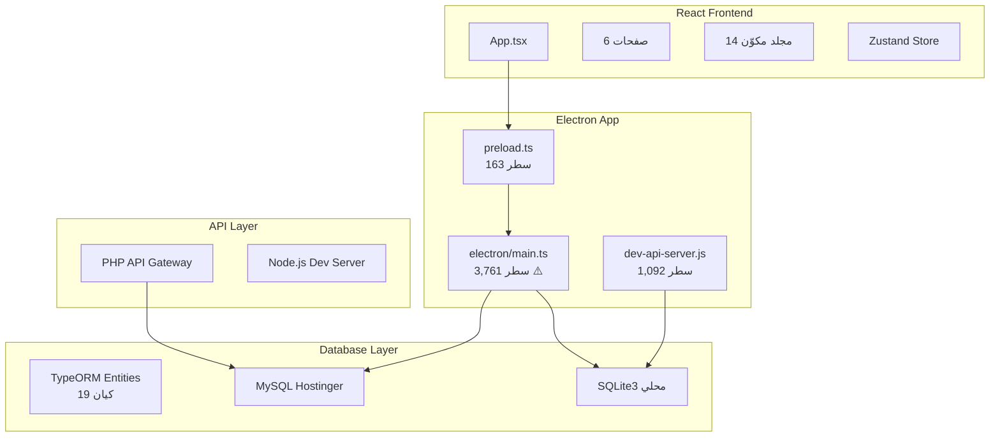
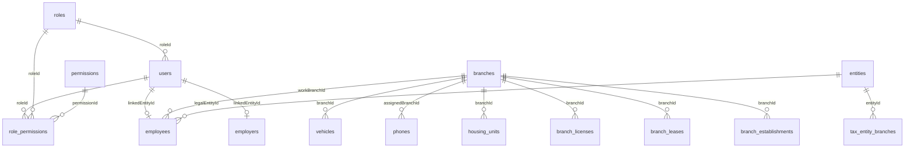
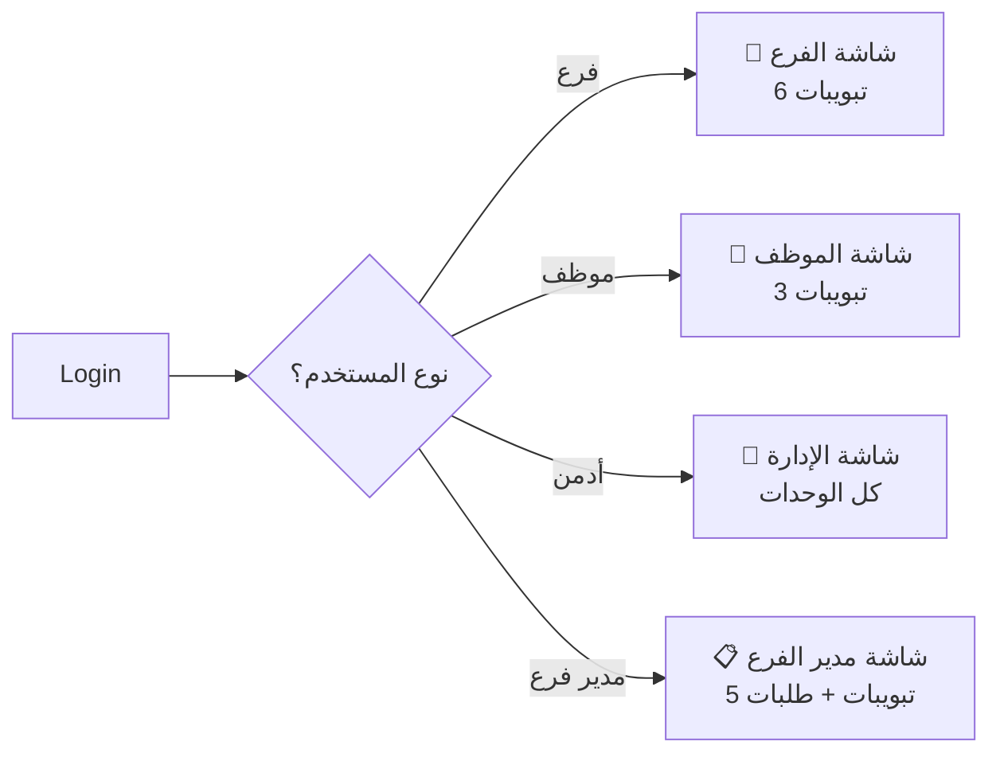
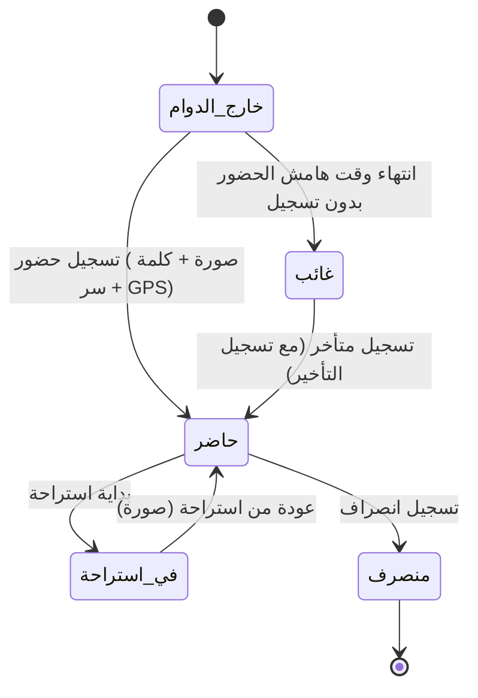

# 🔍 تقرير المراجعة الخبيرة الشاملة — خطة تطوير v2
## نظام RMDATA — شركة الرداء الموحد

> **تاريخ المراجعة**: 30 مارس 2026
> هذا التقرير يتضمن فحصاً عميقاً للنسخة الحالية (v1.1.0) من النظام ومراجعة تفصيلية لتقرير خطة v2 مع ملاحظات وأفكار إضافية.

---

### تحديث قرارات المشروع (مراجعة المالك — مارس 2026)

> يعكس هذا القسم توجّه المالك بعد مناقشة الخطة؛ تُحدَّث الأقسام التفصيلية أدناه لتتماشى معه حيث يلزم.

| الموضوع | القرار المقترح | ملاحظة تقنية |
|--------|----------------|---------------|
| **الاستضافة والخلفية** | الانتقال من **Subdomain + PHP + MySQL على استضافة مشتركة** إلى **VPS** | يقلّل الضغط والقيود النموذجية للاستضافة المشتركة، ويُمكّن **WebSocket** ومنافذ طويلة العمر. توحيد الخلفية على **Node.js** يعني التخلي تدريجياً عن **PHP API Gateway** مع الإبقاء على **MySQL/MariaDB** (على نفس الـ VPS أو خدمة مدارة). |
| **تأثير على Electron** | تغيير طريقة الاتصال بالخادم | Base URL موحّد، مصادقة عبر الـ API؛ يُفضّل أن يمرّ كل الوصول للبيانات البعيدة عبر **REST + WebSocket** بدل اتصال MySQL مباشر من `main` كلما أمكن — يُحسم تفصيلياً في المرحلة 0. |
| **نظام الطلبات** | **صلاحيات لكل نوع طلب** بدل سلاسل موافقات إجبارية | مناسب لشركة \< 100 موظفاً: مثلاً طلب سلفة يُعالَج من لديه صلاحية `approve:salary_advance` (مدير فرع أو دور مخصّص)، وليس شرطاً «الأدمن فقط». يمكن أن يرى مديراً آخر أنواعاً محددة حسب الإعداد. **تعدد الموافقات** يبقى *اختياراً* في الإعداد وليس افتراض الخطة. |
| **إشعارات لحظية + التطبيق مغلق** | **WebSocket على VPS** للحالة المتصلة | WebSocket لا يصل للعميل أثناء إغلاق التطبيق؛ لذلك يُكمّل بـ: **تخزين الإشعارات/الطلبات في DB**، وعند **إعادة فتح البرنامج** جلب الغير مقروء + شارات العدد (مزامنة). للموبايل: **Push** (Expo/FCM) يغطي الخلفية والإغلاق الجزئي. |
| **الدردشة الداخلية** | **مرحلة لاحقة (بعد استقرار الـ API على VPS)** | تُبنى على **نفس WebSocket + REST**؛ لا تُؤجّل لعدم الجدوى بل **لتعقيدها** (مزامنة، صلاحيات، إساءة استخدام). التفاصيل في «فكرة 6» أدناه. |

---

## الجزء الأول: فحص النسخة الحالية (v1.1.0)

### 1. البنية المعمارية الحالية



### 2. نقاط القوة في البنية الحالية

| الجانب | التقييم | التفاصيل |
|--------|---------|----------|
| **بنية TypeORM** | ✅ جيدة | 19 كيان معرّف بشكل منظم مع علاقات واضحة |
| **نظام الصلاحيات** | ✅ مُكتمل (v4) | نظام Granular بـ 170 صلاحية؛ حل مشكلة الهوية (Remote ID mismatch)؛ دعم الحقول والتبويبات. |
| **ربط المستخدم بالموظف** | ✅ مُنجز | `userType: free/linked` مع `linkedEntityType` و`linkedEntityId` |
| **نظام التحديثات** | ✅ مُنجز | Auto-updater مع electron-builder |
| **الترجمة** | ✅ i18next | دعم عربي/إنجليزي |
| **النسخ الاحتياطي** | ✅ تلقائي | كل 24 ساعة |
| **الأجهزة المتصلة** | ✅ مُنجز | `connected_devices` مع device binding |
| **التوافق مع الموبايل** | ✅ جزئي | يمكن فتح الواجهة من الموبايل عبر الشبكة المحلية |
| **دعم جهاز البصمة** | ✅ موجود | مكتبة `node-zklib` و`zklib-js` في `package.json` |

### 3. نقاط ضعف ومخاطر حرجة في البنية الحالية

> [!CAUTION]
> **ملف `electron/main.ts` = 3,761 سطر** — هذا الملف أصبح "God File" خطير جداً. يحتوي على:
> - منطق قاعدة البيانات
> - منطق المصادقة
> - منطق الملفات
> - منطق التحديثات
> - منطق الأجهزة
> - منطق النسخ الاحتياطي
> - منطق الإشعارات
> - وأكثر من 50 IPC handler
>
> **يجب تقسيمه قبل البدء في v2** وإلا سيصبح غير قابل للصيانة.

> [!WARNING]
> **ملف `dev-api-server.js` = 1,092 سطر** — يحتوي على REST API كامل لكن بأعمدة مختلفة عن الـ schema الفعلي!
> مثال: يستخدم `isArchived` و`managerName` في جدول `branches` بينما هذه الأعمدة غير موجودة في الـ schema الفعلي. هذا يعني أن الـ API الحالي **لن يعمل بشكل صحيح مع البيانات الحقيقية**.

> [!WARNING]
> **مشكلة أمنية**: `POST /api/db/query` في dev-api-server يقبل SQL خام من العميل. رغم وجود `assertDbQueryAllowed`، هذا الأسلوب خطير ويجب استبداله بـ endpoints محددة قبل أي نشر إنتاجي.

#### مشاكل تقنية مفصلة:

| المشكلة | الخطورة | التفاصيل |
|---------|---------|----------|
| **God File** | 🔴 حرجة | `main.ts` = 3,761 سطر — يجب تقسيمه فوراً |
| **عدم تطابق API/Schema** | 🔴 حرجة | `dev-api-server.js` يستخدم أعمدة غير موجودة |
| **SQL خام** | 🟡 متوسطة | `db:query` IPC يقبل أي SQL من الـ renderer |
| **migrations.ts ضخم** | 🟡 متوسطة | 44,186 بايت ملف واحد — يجب تقسيمه لملفات مرقمة |
| **لا Unit Tests** | 🟡 متوسطة | لا يوجد أي اختبارات آلية |
| **كاشينج بسيط** | 🟢 منخفضة | `dbClient.ts` كاش 30 ثانية — كافي حالياً لكن ليس لـ v2 |

### 4. الجداول الحالية في قاعدة البيانات



**الجداول الموجودة (22 جدول):**
`users`, `roles`, `permissions`, `role_permissions`, `user_permissions`, `branches`, `entities`, `employers`, `employees`, `branch_employers`, `vehicles`, `phones`, `housing_units`, `housing_installments`, `housing_occupants`, `housing_custom_fields`, `branch_licenses`, `branch_leases`, `lease_installments`, `branch_establishments`, `branch_custom_fields`, `vehicle_custom_fields`, `notifications`, `tax_entity_branches`, `settings`, `tax_payments`, `documents`, `activity_logs`, `employee_status_history`, `status_history`, `connected_devices`

---

## الجزء الثاني: مراجعة تقرير v2 — قسم بقسم

### 📋 القسم 1-2: المقدمة والهدف الرئيسي

> [!NOTE]
> **تقييم**: ممتاز ✅
> الرؤية واضحة جداً — التحوّل من نظام وثائقي إلى منصة تشغيل يومية. الطبقات الثلاث (إدارة عليا، فروع، موظفون) مصممة بشكل منطقي ومتناسق.

**ملاحظة**: يُنصح بتوثيق "User Journey" لكل طبقة — أي رسم الخطوات التي يمر بها كل نوع مستخدم من لحظة فتح التطبيق حتى إنجاز مهامه اليومية.

---

### 📋 القسم 3: المنصات المستهدفة

> [!IMPORTANT]
> **تطبيق موبايل واحد لـ iOS و Android** — قرار صحيح ومنطقي.

**ملاحظاتي التقنية:**

#### **اقتراح التقنية المناسبة**:

| التقنية | المزايا | العيوب | الملاءمة |
|---------|---------|--------|----------|
| **React Native** | قرب من React الحالي، مشاركة منطق | أداء أقل من Native، تعقيد في الكاميرا والـ GPS | ⭐⭐⭐⭐ |
| **Expo (React Native)** | أسهل للنشر، OTA updates | بعض القيود على Native modules | ⭐⭐⭐⭐⭐ |
| **Flutter** | أداء ممتاز، تصميم موحد | لغة Dart جديدة، لا مشاركة كود مع المشروع | ⭐⭐⭐ |
| **PWA (تطبيق ويب تقدمي)** | أسرع تطوير، نفس الكود | لا Push Notifications حقيقية على iOS، لا متجر | ⭐⭐⭐ |
| **Capacitor (Ionic)** | نفس كود React + native plugins | أداء متوسط | ⭐⭐⭐ |

> [!TIP]
> **توصيتي**: **Expo (React Native)** هو الخيار الأمثل لأسباب:
> 1. **EAS Build** — بناء للـ iOS بدون Mac
> 2. **OTA Updates** — تحديث التطبيق بدون إعادة نشر للمتجر
> 3. **expo-camera** — التقاط صور بسهولة
> 4. **expo-location** — GPS مع geofencing
> 5. **expo-notifications** — Push Notifications لـ iOS و Android
> 6. **كود React** — مشاركة جزئية مع المشروع الحالي (types, constants, utils)

**فكرة مهمة 💡**: يمكن إنشاء **monorepo** يحتوي:
```
rmdata/
├── packages/
│   ├── shared/          ← أنواع TypeScript + constants + utils مشتركة
│   ├── desktop/         ← Electron (المشروع الحالي)
│   └── mobile/          ← Expo React Native
├── package.json
└── turbo.json           ← Turborepo for build orchestration
```

---

### 📋 القسم 4: أنواع المستخدمين

> [!NOTE]
> **تقييم**: ممتاز التصنيف ✅ لكن يحتاج تنظيم أكثر في قاعدة البيانات.

**الوضع الحالي** في جدول `users`:
- `role` = `SuperAdmin | Manager | Employee` (enum بسيط)
- `roleId` → جدول `roles`
- `userType` = `free | linked`
- `linkedEntityType` = `employee | employer`

**ما ينقص لدعم v2:**

```sql
-- 1. إضافة نوع مستخدم "فرع"
-- في الحالة الحالية: لا يوجد آلية لتسجيل فرع كمستخدم
-- الحل: توسيع linkedEntityType

ALTER TABLE users ADD COLUMN linkedEntityType VARCHAR(20) NULL
  CHECK (linkedEntityType IN ('employee', 'employer', 'branch'));

-- 2. إضافة حقل لتمييز مدير الفرع
ALTER TABLE employees ADD COLUMN isBranchManager TINYINT(1) DEFAULT 0;

-- 3. إضافة جدول أدوار ديناميكية جديدة
INSERT INTO roles (name, description, isSystem) VALUES
  ('BranchAccount', 'حساب فرع تشغيلي', 1),
  ('BranchManager', 'مدير فرع', 1),
  ('FieldEmployee', 'موظف فرع/متجر', 1);
```

**أفكاري الإضافية حول أنواع المستخدمين:**

1. **⭐ نظام "التنكّر" (Impersonation)**: السماح للأدمن بالدخول مؤقتاً "كما لو أنه" موظف أو فرع لمعاينة ما يراه. مفيد جداً للدعم الفني.

2. **⭐ سجل الصلاحيات المتغيرة**: كل تغيير في صلاحيات مستخدم يُسجّل في `activity_logs` مع التفاصيل (من غيّر، ماذا تغيّر).

3. **⭐ صلاحيات مؤقتة**: مثال — منح موظف صلاحية مؤقتة لتسجيل مبيعات لمدة أسبوع أثناء غياب مدير الفرع.

---

### 📋 القسم 5: ربط جهاز الفرع (Device Binding)

> [!NOTE]
> **تقييم**: تصميم أمني ممتاز ✅

**الوضع الحالي**: جدول `connected_devices` موجود بالفعل ويحتوي:
```
connected_devices:
  id, userId, username, deviceName, deviceId, deviceLabel,
  ipAddress, publicIp, gpsCoords, locationCity,
  appVersion, token, lastActive, createdAt
```

**ما يحتاج إضافة لدعم Device Binding في v2:**

```sql
-- جدول ربط الأجهزة بالفروع (مفهوم مختلف عن connected_devices)
CREATE TABLE branch_device_bindings (
  id INTEGER PRIMARY KEY AUTOINCREMENT,
  branchId INTEGER NOT NULL REFERENCES branches(id),
  deviceId VARCHAR(255) NOT NULL,           -- معرّف فريد للجهاز
  deviceName VARCHAR(200),                  -- اسم الجهاز
  deviceModel VARCHAR(200),                 -- موديل الجهاز
  osType VARCHAR(20),                       -- ios | android
  osVersion VARCHAR(50),
  bindingStatus VARCHAR(20) DEFAULT 'pending',  -- pending | approved | rejected | revoked
  approvedByUserId INTEGER REFERENCES users(id),
  approvedAt DATETIME,
  revokedByUserId INTEGER REFERENCES users(id),
  revokedAt DATETIME,
  revokeReason TEXT,
  gpsLatitude DECIMAL(10, 8),              -- موقع الفرع المعتمد
  gpsLongitude DECIMAL(11, 8),
  lastActiveAt DATETIME,
  createdAt DATETIME DEFAULT CURRENT_TIMESTAMP,
  UNIQUE (branchId, deviceId)
);

-- جدول لتسجيل محاولات الدخول المرفوضة
CREATE TABLE device_access_attempts (
  id INTEGER PRIMARY KEY AUTOINCREMENT,
  branchId INTEGER REFERENCES branches(id),
  userId INTEGER REFERENCES users(id),
  deviceId VARCHAR(255),
  deviceName VARCHAR(200),
  ipAddress VARCHAR(50),
  gpsCoords TEXT,
  attemptType VARCHAR(20),    -- unauthorized_device | revoked_device
  createdAt DATETIME DEFAULT CURRENT_TIMESTAMP
);
```

**أفكاري الإضافية:**

1. **⭐ تعريف هوية الجهاز**: استخدام مزيج من:
   - `expo-application` → `Application.androidId` / iOS `identifierForVendor`
   - `expo-device` → `Device.modelName`, `Device.osVersion`
   - **Fingerprinting ثانوي** — خيار احتياطي في حال إعادة تثبيت التطبيق

2. **⭐ إشعار فوري عند محاولة غير مصرح بها**: Push Notification مباشر للأدمن + صوت تنبيه مختلف (أحمر/عاجل).

3. **⭐ خريطة الأجهزة**: عرض خريطة في لوحة الأدمن تظهر كل الأجهزة المربوطة ومواقعها الجغرافية.

---

### 📋 القسم 6-7: واجهات المستخدمين ومعلومات الفرع

> [!NOTE]
> **تقييم**: التصميم جيد ✅ لكن يحتاج تفصيل أكثر.

**فكرة رئيسية**: استخدام **Dynamic Home Screen** — شاشة رئيسية واحدة تتغير تلقائياً حسب نوع المستخدم:



**أفكاري للتصميم:**

1. **⭐ Bottom Navigation Bar للموبايل** — بدل التبويبات في الأعلى، استخدام شريط سفلي ثابت (أكثر سهولة في الاستخدام):
   ```
   ┌──────────────────────────────────────────┐
   │              محتوى الصفحة                │
   │                                          │
   │                                          │
   ├──────────────────────────────────────────┤
   │  🏠    📋    ⏰    📊    🔔             │
   │ الرئيسية طلبات حضور مبيعات تنبيهات       │
   └──────────────────────────────────────────┘
   ```

2. **⭐ Widget Cards في الشاشة الرئيسية للفرع**:
   - بطاقة "الحضور اليوم" — عدد الحاضرين/الغائبين
   - بطاقة "المبيعات اليومية" — إجمالي اليوم
   - بطاقة "طلبات بانتظار" — عدد الطلبات المعلقة
   - بطاقة "آخر تنبيه" — ملخص آخر تنبيه

3. **⭐ مشاركة المعلومات (القسم 7.2)**: إضافة QR Code تلقائي يحتوي على بيانات الفرع — الزبون يمسح الـ QR فيحصل على كل المعلومات.

---

### 📋 القسم 9: نظام الحضور والانصراف — **أهم قسم** 🔴

> [!IMPORTANT]
> هذا القسم يتطلب تصميم دقيق جداً لأنه يؤثر على الرواتب والموظفين مباشرة.

**الجداول المقترحة:**

```sql
-- سجل الحضور والانصراف
CREATE TABLE attendance_records (
  id INTEGER PRIMARY KEY AUTOINCREMENT,
  employeeId INTEGER NOT NULL REFERENCES employees(id),
  branchId INTEGER NOT NULL REFERENCES branches(id),
  
  -- نوع التسجيل
  recordDate DATE NOT NULL,                -- تاريخ العمل
  
  -- أوقات الحضور
  clockInAt DATETIME,                      -- وقت الحضور الفعلي
  breakStartAt DATETIME,                   -- بداية الاستراحة
  breakEndAt DATETIME,                     -- العودة من الاستراحة
  clockOutAt DATETIME,                     -- وقت الانصراف
  
  -- صور التوثيق
  clockInPhotoPath VARCHAR(500),           -- صورة الحضور
  breakReturnPhotoPath VARCHAR(500),       -- صورة العودة من الاستراحة
  
  -- موقع جغرافي
  clockInGpsLat DECIMAL(10, 8),
  clockInGpsLng DECIMAL(11, 8),
  clockInDistanceMeters INTEGER,           -- المسافة من موقع الفرع
  
  -- حالة الحضور
  status VARCHAR(20) DEFAULT 'clocked_in', -- off_duty, clocked_in, on_break, clocked_out
  isLate TINYINT(1) DEFAULT 0,
  lateMinutes INTEGER DEFAULT 0,
  isAbsent TINYINT(1) DEFAULT 0,
  
  -- مصدر التسجيل
  source VARCHAR(20) DEFAULT 'mobile',     -- mobile | fingerprint | manual
  deviceId VARCHAR(255),                   -- معرّف الجهاز المُستخدم
  
  -- من قام بالتسجيل (في حالة التسجيل اليدوي)
  recordedByUserId INTEGER REFERENCES users(id),
  
  -- تعديلات
  isModified TINYINT(1) DEFAULT 0,
  modifiedByUserId INTEGER REFERENCES users(id),
  modificationNote TEXT,
  
  -- حسابات تلقائية
  totalWorkMinutes INTEGER,                -- إجمالي وقت العمل بالدقائق
  totalBreakMinutes INTEGER,               -- إجمالي وقت الاستراحة
  
  createdAt DATETIME DEFAULT CURRENT_TIMESTAMP,
  updatedAt DATETIME DEFAULT CURRENT_TIMESTAMP,
  
  UNIQUE (employeeId, recordDate)          -- سجل واحد لكل موظف لكل يوم
);

-- فهارس مهمة للأداء
CREATE INDEX IX_attendance_branch_date ON attendance_records(branchId, recordDate);
CREATE INDEX IX_attendance_employee_date ON attendance_records(employeeId, recordDate);
CREATE INDEX IX_attendance_status ON attendance_records(status);
```

**ملاحظاتي على تصميم الحضور:**

1. **⭐ State Machine واضحة** — يجب تعريف حالات الموظف كـ State Machine:



2. **⭐ Geofencing ذكي**: بدل فقط التحقق لحظة الحضور، يمكن:
   - تسجيل المسافة عند كل عملية
   - إنذار إذا خرج الموظف من نطاق الفرع أثناء الدوام (اختياري)

3. **⭐ تقرير حضور يومي تلقائي**: في نهاية كل يوم يُنشئ النظام تلقائياً ملخصاً:
   - من حضر / من تأخر / من غاب
   - يُرسل كإشعار للأدمن/مدير الفرع

4. **⭐ دعم الفترتين**: أقترح إضافة حقل `shiftNumber` في `attendance_records`:
   ```sql
   ALTER TABLE attendance_records ADD COLUMN shiftNumber TINYINT DEFAULT 1; -- 1 = فترة أولى، 2 = فترة ثانية
   ```

5. **⭐ تقنية مقاومة الغش**:
   - **التقاط الصورة**: استخدام `expo-camera` مع `takePictureAsync` — لا يمكن اختيار من المعرض
   - **Live Detection** (اختياري مستقبلاً): التأكد أن الصورة لشخص حقيقي وليست صورة لصورة
   - **Metadata**: تخزين timestamp و GPS داخل بيانات الصورة نفسها كإثبات إضافي

---

### 📋 القسم 10: جدول الدوام الأسبوعي

**الجدول المقترح:**

```sql
CREATE TABLE weekly_schedules (
  id INTEGER PRIMARY KEY AUTOINCREMENT,
  employeeId INTEGER NOT NULL REFERENCES employees(id),
  branchId INTEGER NOT NULL REFERENCES branches(id),
  
  -- أسبوع البدء (يوم الأحد)
  weekStartDate DATE NOT NULL,
  
  -- حالة الجدول
  status VARCHAR(20) DEFAULT 'draft',   -- draft | pending_approval | approved | active | archived
  
  -- من أنشأه ومن وافق
  createdByUserId INTEGER REFERENCES users(id),
  approvedByUserId INTEGER REFERENCES users(id),
  approvedAt DATETIME,
  
  notes TEXT,
  createdAt DATETIME DEFAULT CURRENT_TIMESTAMP,
  updatedAt DATETIME DEFAULT CURRENT_TIMESTAMP,
  
  UNIQUE (employeeId, weekStartDate)
);

-- تفاصيل كل يوم
CREATE TABLE schedule_days (
  id INTEGER PRIMARY KEY AUTOINCREMENT,
  scheduleId INTEGER NOT NULL REFERENCES weekly_schedules(id) ON DELETE CASCADE,
  
  dayOfWeek TINYINT NOT NULL,              -- 0=أحد, 1=اثنين, ..., 6=سبت
  isDayOff TINYINT(1) DEFAULT 0,           -- 1 = إجازة
  
  shiftStartTime TIME,                     -- 09:00
  breakStartTime TIME,                     -- 13:00 (اختياري)
  breakEndTime TIME,                       -- 14:00 (اختياري)
  shiftEndTime TIME,                       -- 18:00
  
  -- هامش التأخير (بالدقائق) — يمكن تخصيصه لكل يوم
  lateToleranceMinutes INTEGER DEFAULT 10,
  
  createdAt DATETIME DEFAULT CURRENT_TIMESTAMP
);
```

**أفكاري الإضافية:**

1. **⭐ الجدول الحالي والقادم** (اقتراح رقم 23.7 في التقرير — أوافق تماماً): يمكن تنفيذه بـ:
   ```
   status = 'active'  ← الجدول الحالي المعمول به
   status = 'approved' ← الجدول القادم المُعتمد
   ```
   وعند بداية الأسبوع الجديد، يقوم scheduler بتحويل `approved` → `active` و `active` → `archived`.

2. **⭐ نسخ الجدول**: زر "نسخ من الأسبوع السابق" لتسهيل الإعداد عندما لا يتغير الجدول.

3. **⭐ جدول "افتراضي"**: مفهوم "Default Schedule" — جدول ثابت يُطبق تلقائياً إذا لم يُنشأ جدول جديد لأسبوع معين. هذا يحل مشكلة النسيان.

---

### 📋 القسم 11: المبيعات اليومية

```sql
CREATE TABLE daily_sales (
  id INTEGER PRIMARY KEY AUTOINCREMENT,
  branchId INTEGER NOT NULL REFERENCES branches(id),
  salesDate DATE NOT NULL,
  
  -- المبالغ حسب طريقة الدفع
  cashAmount DECIMAL(10, 2) DEFAULT 0,
  cardAmount DECIMAL(10, 2) DEFAULT 0,
  transferAmount DECIMAL(10, 2) DEFAULT 0,
  otherAmount DECIMAL(10, 2) DEFAULT 0,
  
  -- الإجمالي (محسوب)
  totalAmount DECIMAL(10, 2) DEFAULT 0,
  
  -- صورة إغلاق الصندوق
  closingPhotoPath VARCHAR(500),
  
  -- ملاحظات
  notes TEXT,
  
  -- من أدخلها
  submittedByUserId INTEGER REFERENCES users(id),
  submittedAt DATETIME,
  
  -- حالة التعديل
  isModified TINYINT(1) DEFAULT 0,
  modifiedByUserId INTEGER REFERENCES users(id),
  modificationApprovedByUserId INTEGER REFERENCES users(id),
  
  -- حالة المراجعة
  reviewStatus VARCHAR(20) DEFAULT 'pending',  -- pending | reviewed | flagged
  reviewedByUserId INTEGER REFERENCES users(id),
  reviewedAt DATETIME,
  
  createdAt DATETIME DEFAULT CURRENT_TIMESTAMP,
  updatedAt DATETIME DEFAULT CURRENT_TIMESTAMP,
  
  UNIQUE (branchId, salesDate)
);

-- بنود المبيعات (لدعم أنواع دفع إضافية مستقبلاً)
CREATE TABLE sales_line_items (
  id INTEGER PRIMARY KEY AUTOINCREMENT,
  dailySalesId INTEGER NOT NULL REFERENCES daily_sales(id) ON DELETE CASCADE,
  paymentMethod VARCHAR(50) NOT NULL,       -- cash, card, transfer, other
  amount DECIMAL(10, 2) NOT NULL,           -- يدعم قيم سالبة (مرتجع)
  description TEXT,
  createdAt DATETIME DEFAULT CURRENT_TIMESTAMP
);
```

**أفكاري:**

1. **⭐ Dashboard مبيعات**: شاشة خاصة في لوحة الأدمن تعرض:
   - مبيعات اليوم لكل فرع (بطاقات ملونة)
   - رسم بياني أسبوعي/شهري
   - مقارنة بين الفروع
   - تنبيه إذا لم يُدخل فرع مبيعاته

2. **⭐ تصدير للمحاسب**: زر تصدير Excel/PDF لفترة محددة — يسهّل على المحاسب وقسم الضرائب.

3. **⭐ هل وصل الفرق للبنك؟**: حقل اختياري "هل تم الإيداع؟" مع رقم الإيداع — للمتابعة المالية.

---

### 📋 القسم 13-15: نظام الطلبات

> [!IMPORTANT]
> نظام الطلبات هو العمود الفقري لـ v2. يجب تصميمه بمرونة عالية.

**توصيتي**: **جدول طلبات موحّد** مع أنواع — وليس جدول لكل نوع طلب.

```sql
CREATE TABLE requests (
  id INTEGER PRIMARY KEY AUTOINCREMENT,
  
  -- معلومات الطلب الأساسية
  requestCode VARCHAR(20) UNIQUE,          -- REQ-2026-00001
  requestType VARCHAR(30) NOT NULL,        -- أنواع الطلبات (انظر أدناه)
  category VARCHAR(20) NOT NULL,           -- employee | branch
  
  -- صاحب الطلب
  requestedByUserId INTEGER NOT NULL REFERENCES users(id),
  requestedByEmployeeId INTEGER REFERENCES employees(id),
  requestedByBranchId INTEGER REFERENCES branches(id),
  
  -- الجهة المستقبلة
  targetRecipientType VARCHAR(20),         -- admin | role | user
  targetRecipientId INTEGER,               -- userId أو roleId
  
  -- البيانات حسب نوع الطلب (JSON مرن)
  requestData JSON,
  /*
    أمثلة على requestData:
    - إجازة: { "fromDate": "...", "toDate": "...", "type": "unpaid|annual" }
    - سلفة: { "amount": 5000, "reason": "..." }
    - بضاعة: { "items": "نص حر", "urgency": "normal|urgent" }
    - تعديل حضور: { "attendanceId": 123, "field": "clockInAt", "oldValue": "...", "newValue": "..." }
    - يونيفورم: { "items": [...], "sizes": [...] }
    - مستندات: { "documentType": "salary_certificate", "language": "ar" }
    - استقالة: { "lastWorkDay": "...", "reason": "..." }
    - تجديد إقامة: { "urgency": "normal|urgent", "notes": "..." }
  */
  
  -- حالة الطلب
  status VARCHAR(20) DEFAULT 'pending',    -- pending | approved | rejected | cancelled | processing
  
  -- قرار الطلب
  decidedByUserId INTEGER REFERENCES users(id),
  decidedAt DATETIME,
  decisionNote TEXT,
  
  -- الأولوية
  priority VARCHAR(10) DEFAULT 'normal',   -- low | normal | high | urgent
  
  -- مرفقات
  attachmentPath VARCHAR(500),
  
  createdAt DATETIME DEFAULT CURRENT_TIMESTAMP,
  updatedAt DATETIME DEFAULT CURRENT_TIMESTAMP
);

-- سجل تغيير حالة الطلب (للتدقيق)
CREATE TABLE request_status_history (
  id INTEGER PRIMARY KEY AUTOINCREMENT,
  requestId INTEGER NOT NULL REFERENCES requests(id) ON DELETE CASCADE,
  fromStatus VARCHAR(20),
  toStatus VARCHAR(20) NOT NULL,
  changedByUserId INTEGER REFERENCES users(id),
  note TEXT,
  createdAt DATETIME DEFAULT CURRENT_TIMESTAMP
);
```

**أنواع الطلبات المُعرّفة:**
```typescript
enum RequestType {
  // طلبات الموظفين
  UNPAID_LEAVE = 'unpaid_leave',
  ANNUAL_LEAVE = 'annual_leave',
  EARLY_DEPARTURE = 'early_departure',
  UNIFORM = 'uniform',
  DOCUMENT_CERTIFICATE = 'document_certificate',
  SALARY_ADVANCE = 'salary_advance',
  RESIGNATION = 'resignation',
  RESIDENCY_RENEWAL = 'residency_renewal',
  DATA_UPDATE = 'data_update',
  
  // طلبات الفروع
  MERCHANDISE = 'merchandise',
  MAINTENANCE = 'maintenance',
  BRANCH_OTHER = 'branch_other',
  
  // طلبات تعديل (مدير الفرع)
  ATTENDANCE_CORRECTION = 'attendance_correction',
  SALES_CORRECTION = 'sales_correction',
  SCHEDULE_CHANGE = 'schedule_change',
}
```

**أفكاري الإضافية:**

1. **⭐ مساران للموافقة (يُختار حسب حجم المنشأة)**:
   - **الافتراضي المقترح للمالك (شركات صغيرة)**: موافقة **من مستوى واحد** يُحدَّد بـ **صلاحية على نوع الطلب** (مثال: `requests.approve.salary_advance`) مربوطة بالأدوار أو بالمستخدم — بدون سلسلة إجبارية. واجهة «طلبات» مرنة حسب من يرى ماذا.
   - **اختياري لاحقاً — Workflow بسيط**: إذا احتجت لاحقاً تعدد موافقات، يُعرَّف كقواعد في `settings` (مثال للمنشآت الأكبر):
     ```
     طلب سلفة > 5000 → مدير الفرع ثم المدير المالي ثم المدير العام
     طلب استقالة → مدير الفرع ثم HR ثم المدير العام
     ```

2. **⭐ SLA (مدة الاستجابة)**: تعريف مدة أقصى للرد على كل نوع طلب:
   - طلب إجازة → 48 ساعة
   - طلب בضاعة → 24 ساعة
   - وإذا تجاوز → إشعار تصعيد

3. **⭐ طلب تجديد الإقامة**: فكرة التنبيه عند 90 يوم ممتازة. أقترح إضافة 3 مراحل:
   - 90 يوم → يظهر طلب التجديد للموظف
   - 60 يوم → تنبيه للأدمن
   - 30 يوم → تنبيه عاجل أحمر

---

### 📋 القسم 16: نظام التنبيهات

> [!TIP]
> التنبيهات الحالية في النظام هي "تنبيهات نظام" (System Notifications — تذكيرات انتهاء وثائق). 
> v2 تضيف نوعاً جديداً: "تنبيهات إدارية" (Admin Notifications — رسائل من الإدارة).
> يجب التمييز بينهما.

```sql
-- تنبيهات إدارية (جديد في v2)
CREATE TABLE admin_notifications (
  id INTEGER PRIMARY KEY AUTOINCREMENT,
  
  -- المرسل
  sentByUserId INTEGER NOT NULL REFERENCES users(id),
  
  -- المحتوى
  title VARCHAR(200) NOT NULL,
  body TEXT NOT NULL,
  priority VARCHAR(10) DEFAULT 'normal',   -- normal | important | urgent
  
  -- الاستهداف
  targetType VARCHAR(20) NOT NULL,         -- all | branches | users | branch_type
  targetIds TEXT,                          -- JSON array: [1, 2, 3] أو null للكل
  
  -- Push Notification
  pushSent TINYINT(1) DEFAULT 0,
  pushSentAt DATETIME,
  
  createdAt DATETIME DEFAULT CURRENT_TIMESTAMP
);

-- حالة القراءة لكل مستلم
CREATE TABLE notification_read_status (
  id INTEGER PRIMARY KEY AUTOINCREMENT,
  notificationId INTEGER NOT NULL REFERENCES admin_notifications(id) ON DELETE CASCADE,
  
  recipientUserId INTEGER REFERENCES users(id),
  recipientBranchId INTEGER REFERENCES branches(id),
  
  isRead TINYINT(1) DEFAULT 0,
  readAt DATETIME,
  
  -- تأكيد استلام (للتنبيهات العاجلة)
  isAcknowledged TINYINT(1) DEFAULT 0,
  acknowledgedAt DATETIME,
  
  createdAt DATETIME DEFAULT CURRENT_TIMESTAMP,
  
  UNIQUE (notificationId, recipientUserId),
  UNIQUE (notificationId, recipientBranchId)
);
```

**أفكاري:**

1. **⭐ مستويات التنبيهات**:
   - **عادي** — يظهر في التطبيق فقط
   - **مهم** — Push Notification + تنبيه صوتي
   - **عاجل** — Push + صوت + يطلب تأكيد قراءة

2. **⭐ تنبيهات مجدولة**: إمكانية جدولة إرسال تنبيه في وقت محدد (مثال: إرسال تعميم يوم الأحد الساعة 8 صباحاً).

3. **⭐ قوالب جاهزة**: مكتبة قوالب للتنبيهات المتكررة (معايدة عيد، تعميم إجازة، إلخ).

---

### 📋 القسم 26: نظام البصمة

> [!NOTE]
> **تقييم**: الدعم موجود جزئياً ✅ — المكتبات `node-zklib` و`zklib-js` مثبتة بالفعل.

**ملاحظات:**

1. البصمة تعمل عبر **نسخة سطح المكتب فقط** — لأن أجهزة ZKTeco تتصل عبر TCP/IP على الشبكة المحلية.

2. **⭐ هيكل الربط المقترح:**

```sql
-- أجهزة البصمة المربوطة
CREATE TABLE fingerprint_devices (
  id INTEGER PRIMARY KEY AUTOINCREMENT,
  branchId INTEGER REFERENCES branches(id),
  deviceName VARCHAR(200),
  ipAddress VARCHAR(50) NOT NULL,
  port INTEGER DEFAULT 4370,
  serialNumber VARCHAR(100),
  model VARCHAR(100),
  isActive TINYINT(1) DEFAULT 1,
  lastSyncAt DATETIME,
  createdAt DATETIME DEFAULT CURRENT_TIMESTAMP
);

-- ربط الموظفين بأرقام البصمة
CREATE TABLE fingerprint_mappings (
  id INTEGER PRIMARY KEY AUTOINCREMENT,
  employeeId INTEGER NOT NULL REFERENCES employees(id),
  fingerprintDeviceId INTEGER NOT NULL REFERENCES fingerprint_devices(id),
  fingerprintUserId INTEGER NOT NULL,      -- الرقم داخل جهاز البصمة
  isActive TINYINT(1) DEFAULT 1,
  createdAt DATETIME DEFAULT CURRENT_TIMESTAMP,
  UNIQUE (fingerprintDeviceId, fingerprintUserId)
);
```

3. **⭐ Sync Scheduler**: خدمة تعمل في الخلفية تسحب سجلات البصمة كل 5 دقائق وتحولها إلى `attendance_records` تلقائياً.

---

### 📋 القسم 23: ملاحظات المعدّ الأصلية — تعليقاتي

| الاقتراح | رأيي | تعليق |
|----------|------|-------|
| 23.1 React Native | ✅ أوافق بشدة | أضيف: استخدم **Expo** تحديداً |
| 23.2 Layout موحد | ✅ أوافق | Dynamic Home Screen حسب الصلاحيات |
| 23.3 تأجيل المراسلة | ✅ أوافق 100% | المراسلة مشروع بحد ذاته؛ مع **VPS** أصبحت ممكنة تقنياً — تُخطَّط كـ **مرحلة 6** بعد استقرار الخادم والمصادقة (انظر فكرة 6) |
| 23.4 "تمت القراءة" أساسي | ✅ أوافق بشدة | أضيف: + "تأكيد الاستلام" للعاجل |
| 23.5 تفاصيل الطلب | ✅ ممتاز | أضيف: + تاريخ SLA + أولوية |
| 23.6 حالات الحضور | ✅ ممتاز | أضيف: + "متأخر بعذر" كحالة |
| 23.7 الجدول الحالي/القادم | ✅ ممتاز | أضيف: + "الجدول الافتراضي" |

---

## الجزء الثالث: أفكاري الإضافية 💡

### فكرة 1: ⭐⭐⭐ Real-time Sync باستخدام WebSocket

النظام الحالي يحتوي بالفعل على `ws` (WebSocket) في `package.json`. على **VPS + خادم Node** يصبح تشغيل WebSocket إنتاجياً عملياً. يُستغل لـ:
- تحديث فوري للحضور على شاشة الأدمن عند تسجيل موظف
- إشعار فوري عند وصول طلب جديد (أثناء اتصال العميل)
- تحديث المبيعات اليومية مباشرة
- لاحقاً: **قناة الدردشة الداخلية** (نفس البنية — انظر فكرة 6) يمكن أن تشترك في خادم WS واحد مع أسماء أحداث مختلفة (`event`, `conversationId`)

**عند إغلاق التطبيق أو انقطاع الاتصال:** الاعتماد على **مصدر الحقيقة في قاعدة البيانات** (طلبات، `notifications`، إلخ) + **مزامنة عند الإقلاع** (جلب الغير مقروء، تحديث القوائم). WebSocket يُكمّل التجربة ولا يحلّ مكان التخزين الدائم. للموبايل: **Push** حيث ينطبق.

### فكرة 2: ⭐⭐⭐ Offline-First للموبايل

التطبيق يجب أن يعمل حتى عند انقطاع الإنترنت:
- تسجيل الحضور يُحفظ محلياً ← يُزامن عند عودة الاتصال
- المبيعات تُحفظ محلياً ← تُزامن لاحقاً
- استخدام **WatermelonDB** أو **SQLite** محلي في الموبايل + sync queue

### فكرة 3: ⭐⭐ نظام التقارير المركزي

```
┌────────────────────────────────────────────────┐
│              📊 لوحة التقارير                   │
├────────────────────────────────────────────────┤
│                                                │
│  تقارير الحضور:                                │
│  • حضور يومي لكل فرع                          │
│  • ملخص تأخيرات الشهر                          │
│  • نسبة الالتزام لكل موظف                      │
│                                                │
│  تقارير المبيعات:                               │
│  • مبيعات يومية/أسبوعية/شهرية                   │
│  • مقارنة بين الفروع                           │
│  • ملخص ضريبي (للمحاسب)                        │
│                                                │
│  تقارير الطلبات:                                │
│  • طلبات بانتظار المعالجة                       │
│  • متوسط وقت الاستجابة                         │
│  • إحصائيات أنواع الطلبات                       │
│                                                │
│  [تصدير PDF]  [تصدير Excel]  [إرسال بالإيميل]  │
└────────────────────────────────────────────────┘
```

### فكرة 4: ⭐⭐ Audit Trail شامل

كل عملية حساسة في v2 يجب أن تُسجّل:
- من سجّل حضور من؟
- من عدّل المبيعات؟
- من وافق على أي طلب؟
- من أرسل أي تنبيه؟

النظام الحالي يحتوي `activity_logs` — يكفي توسيعه ليشمل الوحدات الجديدة.

### فكرة 5: ⭐ لوحة تحكم الأدمن (Admin Dashboard)

شاشة رئيسية مرئية تعرض:
- خريطة الفروع وحالتها (من فتح، من أغلق)
- إحصائيات الحضور اللحظية
- مبيعات اليوم لكل فرع
- طلبات بانتظار
- تنبيهات تحتاج اهتمام

### فكرة 6: ⭐⭐ نظام دردشة داخلي (Company Chat) — بعد توفر VPS

> **السياق**: كان تأجيل المراسلة منطقياً لأن الاستضافة المشتركة لا تُسهّل WebSocket طويل الأمد. مع **خادم VPS + Node** يصبح بناء دردشة داخلية **عملياً**، لكنها **لا تُنفَّذ في نفس دفعة v2 الأساسية** حتى يستقر الـ API والمصادقة والأداء.

**الفكرة التشغيلية (نطاق شركة \< 100 موظفاً):**

| العنصر | الاقتراح |
|--------|-----------|
| **الاستخدام** | تواصل عمليّ: فرع ↔ إدارة، موظف ↔ مدير فرع، مجموعات فرع/قسم (اختياري لاحقاً) — بدل الاعتماد على واتساب للأمور الرسمية. |
| **القناة التقنية** | نفس خادم **Node** على الـ VPS: **WebSocket** للرسائل الفورية + **REST** لتحميل التاريخ والترقيم (pagination). |
| **التخزين** | جداول في **MySQL**: محادثات (`conversations`: direct / group)، مشاركون (`conversation_members`)، رسائل (`messages`: نص، `senderUserId`، `createdAt`، حالة تسليم بسيطة). |
| **المصادقة** | ربط الجلسة بنفس **JWT / الجلسة** المستخدمة للـ API؛ الاتصال بـ WebSocket يمرّ بنفس التوكن (مثلاً في query أو عند `connect`). |
| **الصلاحيات** | قواعد بسيطة حسب **الدور والفرع**: من يمكنه بدء محادثة مع من؛ منع التواصل غير المرغوب (مثلاً موظف فقط مع مدير فرعه إن رُغب). تُدار عبر صلاحيات مثل `chat:dm_any` أو `chat:branch_only`. |
| **الإشعارات** | عند إغلاق التطبيق: الاعتماد على **Push** (موبايل) + **شارة عدد غير المقروء** عند فتح التطبيق (مزامنة من الـ API). |
| **المرفقات** | **مرحلة لاحقة** داخل نفس المشروع: صور/ملفات صغيرة مع فحص ومساحة وحدود حجم. |

**ما يُتجنّب في النسخة الأولى:** محرك دردشة كامل مثل Slack (تعديل الرسائل، ردود ثريد، بوتات، مكالمات صوتية). الهدف **قناة داخلية موثوقة وخفيفة**.

**الاعتماديات:** يجب أن يكون **المرحلة 0** (API إنتاجي + WebSocket) **مستقراً** قبل البدء في الدردشة؛ وإلا ستُضاعَف الجهود التصحيحية.

---

## الجزء الرابع: خارطة الطريق المقترحة لـ v2

> [!IMPORTANT]
> **توصية حاسمة**: لا تبدأ بـ v2 مباشرة! يجب إنهاء الأساسات أولاً.

### المرحلة 0 — التمهيد (منجزة جزئياً)
> تمهيد معماري قبل دخول الانتقال إلى VPS.

- [x] تقسيم `electron/main.ts` إلى modules (IPC handlers, auth, files, backup, etc.) ✅ تم التنفيذ (مارس 2026)

### المرحلة 0.5 — إعداد VPS الأساسي (تنفذ أولاً) (1-2 أسبوع)
> الهدف: تجهيز بيئة إنتاج مستقرة دون إيقاف النظام الحالي.

> **حالة التقدّم (أبريل 2026 — إغلاق مرحلة 0.5 تشغيلياً):** بيئة **PHP + MariaDB + Nginx + SSL** جاهزة؛ **`Node.js LTS` + `PM2`** (`rmdata-node-api` + `dev-api-server.js` على MariaDB)؛ **`Nginx`** يمرّر **`/node-api/`** على نفس **`api.rmdata.tech`**؛ **التحقق المشترك للقاعدة** عبر [`scripts/vps-validate-shared-db.sh`](../scripts/vps-validate-shared-db.sh). **النسخ الاحتياطي:** `crontab` يومي + **`RETENTION_DAYS=15`** + [`scripts/vps-backup-daily.sh`](../scripts/vps-backup-daily.sh)؛ يُفضّل مصادقة **`mysqldump`** عبر **`~/.my.cnf`** (صلاحيات `600`) بدل كلمة المرور في سطر cron. **`pm2 startup systemd`** + **`pm2 save`** لإعادة التشغيل بعد reboot. **ما يبقى اختياري (مو مانع لاعتبار 0.5 منجزة):** اختبار **reboot** سريع ثم `pm2 list` + `curl /api/health`؛ اختبار **استعادة مصغّر** من `db.sql` على قاعدة اختبار؛ التأكد أن مسار **`storage`** في السكربت يطابق التخطيط الفعلي (`html/storage` مقابل `html/api-gateway-php/storage`) ونسخ **`.env`** إن لزم توسيع السكربت — انظر [`docs/vps_phase05_closeout.md`](vps_phase05_closeout.md).

- [x] تجهيز الخادم: تحديث النظام + إعداد جدار ناري + مستخدم تشغيل آمن ✅ (Ubuntu 24.04 VPS، قواعد هوستنجر 22/80/443، مستخدم `deploy` + `sudo`، `mysql_secure_installation`)
- [x] تثبيت وتشغيل **`Nginx`** + **`PHP-FPM`** + **`MariaDB`** ✅
- [x] تثبيت **`Node.js LTS`** + **`PM2`** + تشغيل Node API (`rmdata-node-api`) + **`pm2 startup`** + **`pm2 save`** ✅
- [x] تفعيل **`SSL`** (Let's Encrypt) لـ `api.rmdata.tech` ✅
- [x] تشغيل PHP Gateway — **`https://api.rmdata.tech`** + رفع الكود + استيراد `rmdata_db` + اختبار اتصال من التطبيق ✅
- [x] ربط Node عبر **`proxy_pass`** تحت **`/node-api/`** على نفس الدومين (بديل عملي عن subdomain منفصل) ✅
- [x] PHP و Node على **نفس MariaDB** + اختبار قراءة/كتابة مشترك (`vps-validate-shared-db.sh`) ✅
- [x] النسخ الاحتياطي اليومي للقاعدة + `storage` + احتفاظ **15 يوم** (`crontab` + `vps-backup-daily.sh` + تحقق يدوي ناجح) ✅
- [x] **(اختياري)** اختبار إعادة تشغيل الخادم + smoke test استعادة من أحد مجلدات `/var/backups/rmdata/` — موثّق في [`scripts/vps-verify-phase05.sh`](../scripts/vps-verify-phase05.sh)

### المرحلة 0.6 — التشغيل المزدوج (Bridge) (تنفذ ثانياً) (1 أسبوع)
> الهدف: نقل تدريجي آمن بدون توقف الخدمة.
> **حالة التقدّم (أبريل 2026):** بعد إغلاق المرحلة **0.5**، تم بدء **المرحلة A من 0.6** فعلياً عبر جرد endpoints وسياسة Bridge/Fallback وتحديث runbook التشغيلي.
> **مرجع التنفيذ والتحليل العميق لـ 0.6 + 0.7:** [`docs/phase06_07_deep_analysis_plan.md`](phase06_07_deep_analysis_plan.md)
> **مخرجات المرحلة A:** [`docs/phase06_endpoint_inventory.md`](phase06_endpoint_inventory.md) + تحديث [`docs/vps_final_merge_runbook.md`](vps_final_merge_runbook.md) (ملحق Bridge/Rollback).
> **نتيجة canary step 1:** نجاح canary endpoint عبر `/api/health` (توجيه انتقائي منخفض المخاطر إلى Node) — **أول cutover فعلي منخفض المخاطر تم بنجاح**.
> **نتيجة canary step 2:** نجاح نقل `api/branches*` إلى Node (CRUD + archive) على المسار الإنتاجي `/api/branches` بدون أخطاء تشغيلية.
> **نتيجة canary step 3:** نجاح نقل `api/employers*` إلى Node (CRUD + archive) على المسار الإنتاجي `/api/employers` بدون أخطاء تشغيلية.
> **نتيجة canary step 4:** نجاح نقل `api/vehicles*` إلى Node (CRUD + archive) على المسار الإنتاجي `/api/vehicles` بدون أخطاء تشغيلية.
> **نتيجة canary step 5:** نجاح نقل `api/employees*` إلى Node على المسار الإنتاجي `/api/employees` بدون أخطاء تشغيلية.
> **نتيجة canary step 6:** نجاح نقل `api/phones*` إلى Node (CRUD + archive) على المسار الإنتاجي `/api/phones` بدون أخطاء تشغيلية.
> **نتيجة canary step 7:** نجاح نقل `api/settings*` و `api/tax/*` إلى Node على المسار الإنتاجي بدون أخطاء تشغيلية.
> **نتيجة canary step 8:** نجاح نقل `api/housing*` إلى Node (CRUD + archive) على المسار الإنتاجي `/api/housing` بدون أخطاء تشغيلية.

- [x] اعتماد قاعدة موحدة: **Node هو المسار الجديد** لأي endpoint جديد (بدأ التنفيذ العملي بنجاح عبر canary `/api/health`)
- [x] الإبقاء على PHP فقط للمسارات غير المنقولة بعد (مع نقل انتقائي ناجح لـ `health` ثم `branches`)
- [ ] توحيد `schema migrations` في مسار واحد فقط (لا تعديلات عشوائية على DB)
- [x] تعريف قائمة endpoints الحالية وتصنيفها: (نُقل / قيد النقل / قديم) — موثق في `phase06_endpoint_inventory.md`
- [x] إضافة Health Checks ومراقبة سجلات للأخطاء (`PM2 logs` + Nginx access/error) — موثق في ملحق Bridge داخل `vps_final_merge_runbook.md`
- [x] خطة Rollback واضحة: الرجوع المؤقت لـ PHP endpoint عند فشل endpoint من Node — موثقة في ملحق Bridge داخل `vps_final_merge_runbook.md`

### المرحلة 0.7 — مطابقة API مع الـ Schema (تنفذ ثالثاً) (1-2 أسبوع)
> تنفيذ بند إصلاح السيرفر (`dev-api-server.js`) لكن على بيئة VPS الجاهزة.
> **حالة التقدّم (أبريل 2026 — إغلاق المرحلة B تشغيلياً):** تم إغلاق blocker رفع الملفات (`POST /api/files/upload`) على Node، وتفعيل JWT parity فعلياً على VPS (token بصيغة JWT)، وإصلاح mismatch `housing -> housing_units`، وتحديث مسار فتح الملفات ليدعم الصيغتين (`documents/...` وبدون البادئة). مرجع التوافق المرحلي: [`docs/phase07_schema_matrix.md`](phase07_schema_matrix.md).
> **نتائج التحقق الحالية (VPS):** `health` + `login` + `db/query` + `files/upload` + `files/open` + `branches CRUD` + `employers CRUD` + `vehicles CRUD` + `employees CRUD` + `phones CRUD` + `housing CRUD` + `settings` + `tax` ناجحة.

- [x] إصلاح `dev-api-server.js` ليطابق الـ schema الفعلي (تم إغلاق الموارد الأساسية المطلوبة في 0.7)
- [ ] إزالة/تصحيح الأعمدة غير الموجودة (مثل `isDeleted`, `plateSource` وأي تعارض مشابه) (جزء كبير من `housing` أُغلق)
- [x] توحيد استعلامات المركبات/الأفرع/المستندات مع الجداول الفعلية (المستندات/الأفرع/أصحاب العمل/المركبات أُغلقت)
- [ ] تقليل الاعتماد على SQL الخام حيث أمكن، أو تقييده بصرامة
- [x] اختبار يدوي لكل endpoint أساسي من التطبيق (Login, db:query, documents) — ناجح على VPS
- [x] تثبيت تقرير توافق نهائي: Endpoint ↔ Table/Columns (`phase07_schema_matrix.md` محدث بحالة readiness الحالية)

#### قرار توثيقي: إغلاق مرحلة 0.7 وماذا تعني خانات `[ ]` الباقية

- **إغلاق 0.7 — نطاق تشغيلي (معتمد):** تم استيفاء مواءمة `dev-api-server.js` مع MariaDB للمسارات المخططة للجسر والـ canary: **`auth`**، **`/api/files/*`**، **`POST /api/db/query`**، وموارد REST المسجّلة **Ready** في [`docs/phase07_schema_matrix.md`](phase07_schema_matrix.md) (مع تحقق VPS المذكور في الفقرة أعلاه). الأرشيف والمستندات في وضع Remote يعتمدان على نفس الطبقة (`db/query` + `files`) ولا يتطلّبان canary REST منفصلاً.

- **ليست شرطاً لإعادة فتح 0.7 (متابعة تقنية / دين تقني):** البنود غير المعلّمة أعلاه (`isDeleted` / `plateSource`، تقليل SQL الخام) تعني **تنظيفاً تدريجياً في المستودع** أو **رفع صرامة الأمان على `db/query`** — هدف أشد من «إغلاق 0.7 التشغيلي»، ويمكن جدولتها مع **0.85** (انظر § «المرحلة 0.85» أدناه: قرار نطاق `db/query` + checklist) أو كتحسينات مستمرة دون إلغاء اعتبار 0.7 منجزة للنطاق المتفق عليه.

- **استثناء معروف في المصفوفة:** `GET /api/stats/summary` ما زال **Partially fixed** إلى أن يُستكمل التحقق أو تُحدَّد أولوية الإصلاح؛ **لا يمنع** البدء بـ 0.8 إن لم تكن الإحصائيات حاجزاً لتجربة المستخدم الحالية.

- **الخلاصة:** **نعتبر مرحلة 0.7 مغلقة تشغيلياً** للنطاق المتفق عليه (Bridge + مواءمة الموارد + ملفات + مصادقة + تقرير توافق). الدخول في **0.8** منطقي بعد هذا الإغلاق، بشرط تنفيذ 0.8 **على مراحل (MVP → Full)** حسب [`docs/permissions_rearchitecture_review.md`](permissions_rearchitecture_review.md) والإبقاء على **مراقبة** PM2/Nginx و**Rollback** موثّق.

**جاهزية الدخول في 0.8:** **نعم** — الفريق جاهز لبدء مرحلة **الصلاحيات والأداء**؛ لا تتطلّب 0.8 «مطابقة 100% لكل سطر في Node»، بل بناء **محرك صلاحيات وأداء** فوق واجهة الإنتاج المستقرة. يُنصح بتحديد نطاق أسبوعين أولى (Catalog + Resolver أساسي + سياسة كاش أولية) قبل توسيع Field-level masking والقياسات الثقيلة.

### المرحلة 0.8 — إعادة هيكلة الصلاحيات + الأداء (Security Core) (تنفذ رابعاً) (2-4 أسابيع، حسب النطاق)
> **المرجع التفصيلي:** [`docs/permissions_rearchitecture_review.md`](permissions_rearchitecture_review.md) — يشمل التصميم (Catalog، Resolver، سياق الفرع، سياسات الحقول، Masking، Audit) و**قسم 18 (Performance)** إلزامي.
> **Checklist التنفيذ العملي (المرحلة A):** [`docs/permissions_phaseA_checklist.md`](permissions_phaseA_checklist.md).

بعد **إغلاق 0.7 تشغيلياً** (استقرار المسارات المنقولة + مواءمة schema للنطاق المتفق عليه)، لا يُبنى v2 على نموذج صلاحيات هش؛ هذه المرحلة تثبت **محرك الصلاحيات** قبل توسيع الطلبات والشاشات الحساسة.

**تصميم ونطاق (ملخص — التفاصيل في الملف المرجعي):**
- [ ] **Permission Catalog** موحّد (مفاتيح مستقرة) + طبقات الدور/المستخدم/الفرع/المؤقت
- [ ] **Resolver** بترتيب واضح (deny يتغلب) + تدقيق تغييرات الصلاحيات
- [ ] **Field-level / Masking** حيث يلزم للبيانات الحساسة (رواتب، عقود، بنكي)
- [ ] **خطة تنفيذ مرحلية** (MVP → Full) دون كسر الإنتاج

**أداء — غير قابل للتجاهل (انظر §18 في نفس الملف):**
- [ ] **Caching** لنتيجة الصلاحيات الفعّالة: **لا** إعادة حساب كاملة على كل طلب HTTP افتراضياً
- [ ] **`permissionVersion` (أو ما يعادله)** + مفتاح كاش واضح؛ إبطال عند أي تغيير صلاحيات/أدوار/فرع
- [ ] كاش جانب الخادم (Redis أو LRU في العملية) + توسيع نمط **client** (`permissions-changed` / `clearPermissionsCache`) لـ v2
- [ ] قياس p95 لـ `resolvePermission` في التطوير (أهداف تقريبية في §18.6)

### المرحلة 0.85 — تثبيت الإنتاج على Node تدريجياً (تنفذ خامساً) (1 أسبوع)
> بعد نجاح 0.7 (ومع تقدم متوازٍ أو لاحق لـ 0.8 حسب التنسيق)، يبدأ تقليل الاعتماد على PHP بشكل آمن.

> **قرار نطاق (أبريل 2026):** تشديد أمان **`POST /api/db/query`** — بما في ذلك **SELECT-only** على الـ endpoint و/أو **صلاحية صريحة** لأي تنفيذ كتابة عبر SQL الخام، و**تقليل الاعتماد على SQL الخام** تدريجياً — **مجدول هنا (0.85)** وليس ضمن إغلاق **0.8** (الذي يركز على محرك الصلاحيات + الأداء §18). يمكن بعد **0.8** ربط التشديد بمفتاح صلاحية (مثل `api.db.query.mutate`) إن وُجد Resolver جاهز.

- [ ] بناء API Server إنتاجي (Node.js + Express/Fastify + ORM) على VPS كنقطة اعتماد رئيسية
- [ ] تفعيل **WebSocket** على نفس الخادم (أو خدمة مرافقة) للأحداث اللحظية
- [ ] تحويل endpoints الحرجة أولاً (Auth, Documents, Vehicles, Notifications)
- [ ] إبقاء PHP fallback مؤقتاً حتى اكتمال التحقق النهائي
- [ ] **أمان `db/query` (0.85):** تشديد السياسة على `dev-api-server` (أو البوابة): SELECT-only افتراضياً و/أو رفض `INSERT/UPDATE/DELETE` إلا لمن يملك صلاحية؛ مراجعة استدعاءات العميل (Electron/Remote) قبل التفعيل؛ سجلات/تدقيق عند الحاجة.

### المرحلة 0.9 — تحسينات الجودة والتنظيم (تنفذ سادساً) (3-5 أيام)
> بعد استقرار التشغيل على VPS والانتقال التدريجي، نضيف تحسينات الجودة.

- [ ] كتابة اختبارات أساسية للـ API
- [ ] إعداد monorepo إذا اخترتم Expo

### المرحلة 1 — الطبقة الأساسية (3-4 أسابيع)
- [ ] إضافة جداول v2 (attendance, weekly_schedules, daily_sales, requests, admin_notifications)
- [ ] تعريف أنواع المستخدمين الجديدة (فرع، مدير فرع)
- [ ] بناء Device Binding API
- [ ] بناء نظام الحضور (Backend + API)
- [ ] بناء نظام الجداول (Backend + API)

### المرحلة 2 — تطبيق الموبايل (4-5 أسابيع)
- [ ] إنشاء مشروع Expo
- [ ] شاشة تسجيل الدخول + Device Binding
- [ ] واجهة الفرع (6 تبويبات)
- [ ] واجهة الموظف (3 تبويبات)
- [ ] نظام الحضور (كاميرا + GPS + كلمة سر)
- [ ] نظام المبيعات
- [ ] Push Notifications (Expo + FCM/APNs)

### المرحلة 3 — الطلبات والتنبيهات (3 أسابيع)
- [ ] واجهة الطلبات (إنشاء + متابعة)
- [ ] لوحة الطلبات حسب **الصلاحيات** (موافقة/رفض — ليس شرطاً «أدمن فقط»)
- [ ] نظام التنبيهات الإدارية
- [ ] "تمت القراءة" + تأكيد الاستلام

### المرحلة 4 — سطح المكتب + التقارير (2-3 أسابيع)
- [ ] إضافة تبويبات الحضور والمبيعات في الفروع (Desktop)
- [ ] لوحة الطلبات في Desktop
- [ ] نظام التنبيهات في Desktop
- [ ] تقارير الحضور والمبيعات
- [ ] Dashboard الأدمن

### المرحلة 5 — الاختبار والنشر (2 أسابيع)
- [ ] اختبار شامل مع فرع واحد
- [ ] إصلاح المشاكل
- [ ] نشر على TestFlight (iOS) و Internal Testing (Android)
- [ ] تدريب المستخدمين
- [ ] نشر تدريجي

### المرحلة 6 — الدردشة الداخلية (3-4 أسابيع، بعد استقرار المراحل 0-3)
> تبدأ **فقط** عند استقرار **API على VPS** + **WebSocket** + **مصادقة موحّدة** (لا تُشغّل بالتوازي مع إصلاح الأساسات).

- [ ] جداول المحادثات والرسائل + صلاحيات الدردشة في الـ API
- [ ] خدمة WebSocket للرسائل (غرف أو `conversationId` في الـ payload)
- [ ] واجهة دردشة في **الموبايل** (Expo) — قائمة محادثات + شاشة رسائل
- [ ] واجهة دردشة في **Desktop** (Electron) إن رُغب نفس التجربة
- [ ] غير مقروء + مزامنة عند فتح التطبيق؛ Push للموبايل عند رسالة جديدة (اختياري في النسخة الأولى)
- [ ] سياسة استخدام بسيطة (منع الإساءة، احتفاظ سجلات للتدقيق عند الحاجة — ربط بـ `activity_logs` أو جدول تدقيق رسائل)

---

## الجزء الخامس: ملخص النقاط الحرجة التي يجب حسمها

| # | القرار | الخيارات | توصيتي |
|---|--------|----------|--------|
| 1 | تقنية الموبايل | React Native / Expo / Flutter / PWA | **Expo** |
| 2 | بنية الطلبات | جدول لكل نوع / جدول موحد | **جدول موحد + JSON** |
| 3 | Push Notifications | Firebase FCM / OneSignal / Expo Push | **Expo Push** (أبسط) |
| 4 | تخزين الصور | Local / S3 / Hostinger | **Hostinger + CDN** |
| 5 | هوية الجهاز | Native Device ID / Custom UUID | **Native + Fallback UUID** |
| 6 | Offline Strategy | Online-only / Offline-first | **Offline-first** (ضروري) |
| 7 | مستويات الموافقة | مستوى واحد حسب صلاحية نوع الطلب / متعدد اختياري | **افتراضياً: صلاحيات لكل نوع طلب**؛ تعدد الموافقات **اختياري** في الإعداد للتوسع لاحقاً |
| 8 | استضافة الـ API | استضافة مشتركة + PHP / VPS + Node | **VPS + Node** (يتسق مع WebSocket وتقليل الاعتماد على PHP) |
| 9 | الدردشة الداخلية | لا / نعم لاحقاً | **نعم كمرحلة 6** — نفس WebSocket + MySQL؛ نطاق خفيف مناسب للـ \<100 موظفاً |

---

> [!TIP]
> **خلاصة**: التقرير الذي أعددته شامل وممتاز ويغطي جميع الجوانب التشغيلية. البنية الحالية للنظام يمكن أن تدعم هذا التوسع لكن يجب **تقسيم main.ts + إصلاح API Server + بنية تحتية إنتاجية (يفضّل VPS + Node + WebSocket)** قبل البدء في بناء v2. **المرحلة 0.8** تثبت **محرك الصلاحيات** (انظر `docs/permissions_rearchitecture_review.md`) مع **كاش وإبطال صحيح** حتى لا يُحسب كل شيء على كل طلب. حاسم أيضاً: **نموذج الطلبات بالصلاحيات** و**مزامنة الإشعارات عند إعادة فتح التطبيق** إلى جانب Push للموبايل. **الدردشة الداخلية** تُضاف بعد استقرار الخادم (انظر المرحلة 6). الأهم هو حسم القرارات التقنية (تقنية الموبايل، بنية الطلبات، Push، تخزين الصور، Offline strategy، استضافة الـ API) قبل كتابة أي سطر كود.
